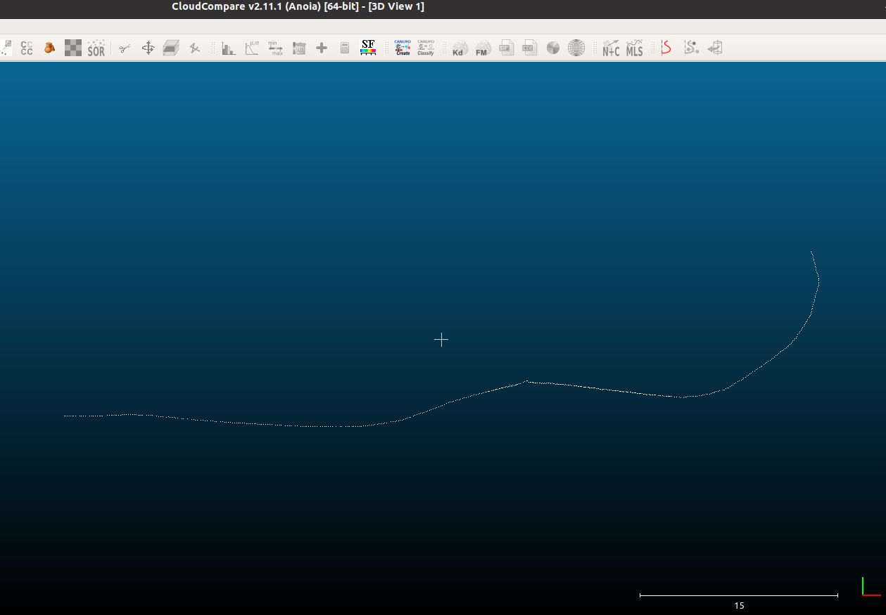

# Pose to PCD Converter
This Python script converts geometry_msgs/PoseStamped or geometry_msgs/PoseWithCovarianceStamped messages from a ROS bag file or csv file into a Point Cloud Data (PCD) file using the Open3D library.

## Requirements
You can install the required packages using the following commands:

```bash
pip install rospy
pip install rosbag
pip install open3d
pip install numpy
```

## Usage

Run the script using the following command:

```bash
python pose-rosbag2pcd.py <input_bag> <output_pcd> <target_topic>
```
- <input_bag>: Path to the input ROS bag file containing PoseStamped or geometry_msgs/PoseWithCovarianceStamped messages.
- <output_pcd>: Path to the output PCD file where the converted point cloud data will be saved.
- <target_topic>: The topic containing the PoseStamped messages in the input ROS bag file.

or

```bash
python pose-csv2pcd.py <input_csv> <output_pcd> <target_topic>
```
- <input_csv>: Path to the input PoseStamped csv file.
- <output_pcd>: Path to the output PCD file where the converted point cloud data will be saved.

## Example

```bash
python pose-rosbag2pcd.py sample/sample.bag pose.pcd /current_pose
```
This command will read PoseStamped messages from the /current_pose topic in the sample/sanple.bag file and save the point cloud data to the pose.pcd file.

of

```bash
python pose-csv2pcd.py sample/sample.csv pose.pcd
```

This script was tested using the [Stevens VLP16 Dataset](https://github.com/TixiaoShan/Stevens-VLP16-Dataset) by Tixiao Shan.



