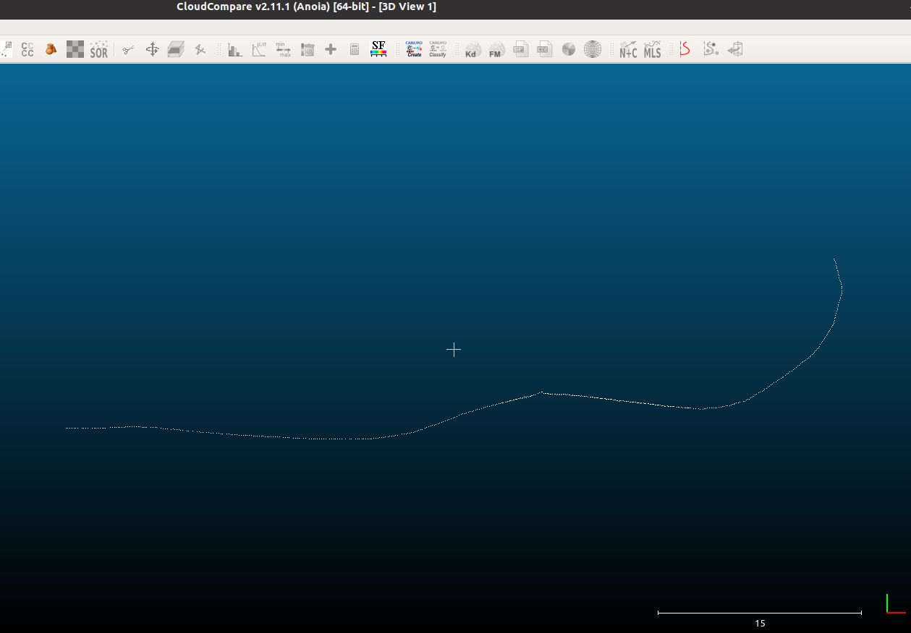

# ROS DATA TOOLS

## ROS1 Pose to PCD Converter
This Python script converts geometry_msgs/PoseStamped or geometry_msgs/PoseWithCovarianceStamped messages from a `rosbag` file or `csv` file into a Point Cloud Data (PCD) file using the Open3D library.

## ROS2 Bag Play Excluder

ROS2 Bag Play Excluder is a simple shell script for filtering and playing back ROS2 bag files while excluding specified topics.